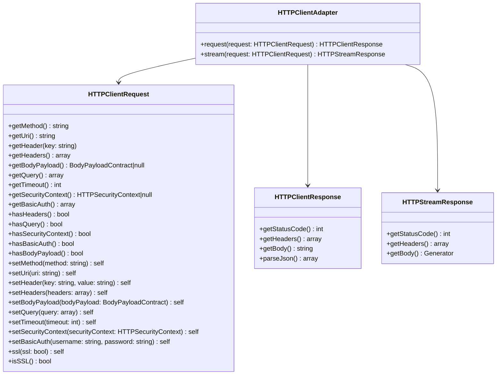

# Adapter Implementation Guide

This guide is for implementers building adapters on top of `easy-http/contracts`.

It explains:

- the core contracts adapters must implement
- expected exception behavior (PSR-18 aligned)
- expected event semantics

## Core Contracts

The adapter layer is centered on these contracts:

- `HTTPClientAdapter`
- `HTTPClientRequest`
- `HTTPClientResponse`
- `HTTPStreamResponse`

### `HTTPClientAdapter`

`HTTPClientAdapter` is the main integration point. Implementers must provide:

- `request(HTTPClientRequest $request): HTTPClientResponse`
- `stream(HTTPClientRequest $request): HTTPStreamResponse`

### `HTTPClientRequest`

Represents the normalized request input that adapters consume.
Adapters should read and map request information from this object into their underlying client implementation.

### `HTTPClientResponse`

Represents a standard (non-stream) HTTP response returned by `request(...)`.

### `HTTPStreamResponse`

Represents a stream-oriented response returned by `stream(...)`.
Use this for streaming use-cases while preserving adapter-level consistency.

## Exception Handling Rules (PSR-18 Aligned)

Adapters must treat valid HTTP responses as successful executions, even when the status code is `4xx` or `5xx`.

In other words:

- `400`, `401`, `404`, `422`, `500`, `503`, etc. are valid HTTP responses.
- These responses **must** be returned as `HTTPClientResponse`/`HTTPStreamResponse` objects.
- Exceptions are reserved for cases where a valid HTTP response cannot be obtained.

### Required Rules

Implementers should follow these rules:

1. **Do not throw for HTTP status codes**
   - If the upstream client returns a valid response object, return it as `HTTPClientResponse`/`HTTPStreamResponse`.
   - Do not transform `4xx/5xx` responses into exceptions.

2. **Throw for transport/runtime failures**
   - Timeouts
   - Connection failures
   - DNS resolution failures
   - TLS/SSL handshake failures
   - Socket/network-level failures

3. **Throw for malformed/invalid response construction**
   - If the adapter cannot build a valid `HTTPClientResponse`/`HTTPStreamResponse` from upstream output, throw an exception.

## Exception Type Guidance

Use these exceptions consistently:

- `HTTPConnectionException`
  - network/connection/transport failures (timeout, DNS, connection refused, TLS, etc.)
- `HTTPClientException`
  - other request-execution failures not covered by `HTTPConnectionException`

## Event Semantics

Given the current event model:

- `request.started` should be emitted when execution begins
- `request.succeeded` should be emitted for successful `request(...)` responses
- `stream.succeeded` should be emitted for successful `stream(...)` responses
- `request.failed` should be emitted when execution raises an exception

Under this policy:

- `4xx/5xx` responses still count as success events
- failures are transport/runtime failures, not HTTP status classes

## Why This Policy

This keeps behavior deterministic across adapters and aligns with PSR-18 principles:

- well-formed HTTP responses are not exceptional
- exceptions represent inability to complete transport or construct valid response contracts
